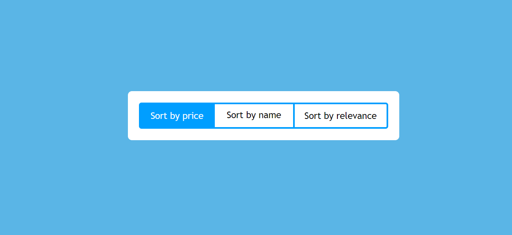
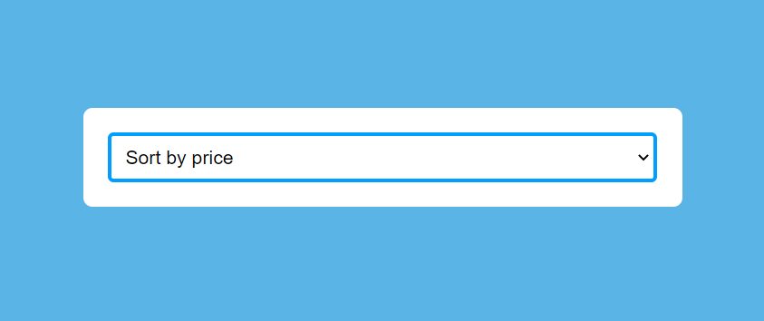

# 🥋 Kata : Toggling tabs

*This is a Kata to improve my skills.*

### 📝 Definition

You said Kata ?

Yes ! Kata or Code Kata comes from Japanese martial arts and aims to improve these skills through the practice of repetition, using algorithms or exercises.

### 📝 Description

The objective of this kata is to Create a segmented control that turns into select tag for mobile screens.  
They synchronize each time one of them is modified.

### ✨ Render

Desktop :

Mobile :

